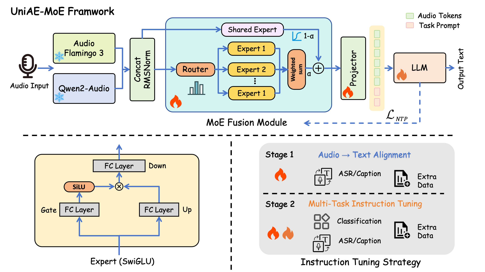

# UniAE-MoE: A Unified Audio Encoder via Mixture of Experts

This repository contains the official implementation for the work "UniAE-MoE: A Unified Audio Encoder via Mixture of Experts".



## Abstract
>Large Audio Language Models (LALMs) rely on effective audio encoders for multi-task performance. We introduce **UniAE-MoE**, a unified audio encoder designed to model cross-domain audio representations and achieve outstanding downstream LLM performance via a Mixture-of-Experts (MoE) architecture.
Specifically, we explore mainstream audio encoders and integrate those from Qwen2-Audio and Audio-Flamingo 3, which demonstrate superior downstream capabilities. To facilitate effective model fusion, we propose an advanced MoE module that uses SwiGLU with shared experts to decouple encoder networks, and we further introduce a two-stage instruction-tuning strategy to better adapt the model to diverse downstream tasks. Moreover, we propose the task-specific data scaling (TSDS) technique to enhance downstream performance of UniAE-MoE. 
Experiments on the XARES-LLM benchmark shows the UniAE-MoE achieves a high score of **0.802**, indicating high performance cross speech, music and audio tasks.

## 🚀 Get Started

### 🔧 Download pretrained models

Our code can automatically download the required pretrained models. If the automatic download fails (e.g., due to network restrictions), you can download the models manually from Hugging Face and place them under the `UniAE-MoE/` directory.

Required models:
- **Qwen2-Audio** (Hugging Face repo: `Qwen/Qwen2-Audio-7B`)  
  https://huggingface.co/Qwen/Qwen2-Audio-7B

- **Flamingo3** (Hugging Face repo: `nvidia/audio-flamingo-3-hf`)  
  https://huggingface.co/nvidia/audio-flamingo-3-hf

- **UniAE-MoE** (Hugging Face repo: `Syclus/UniAE-MoE`)  
  https://huggingface.co/Syclus/UniAE-MoE

After downloading, please ensure your local directory structure looks like this:

```text
.../
└── UniAE-MoE/
    ├── Qwen2-Audio-7B/          # from Qwen/Qwen2-Audio-7B
    ├── audio-flamingo-3-hf/     # from nvidia/audio-flamingo-3-hf
    ├── checkpoints/             # from Syclus/UniAE-MoE
    └── ...
```

Alternatively, you can skip downloading the models in advance. The code will automatically download the models to the specified path during evaluation.

### 👀 Environment

### Install ffmpeg

Install ffmpeg to ensure dataset unpacking works properly
```bash
conda install -y -c conda-forge ffmpeg
```

On Ubuntu, you can also use:
```bash
apt install -y ffmpeg
```

### Set up the uv environment

```bash
cd UniAE-MoE
uv sync
source .venv/bin/activate
```

### 🤖 training

Single GPU Training:

```bash
python -m xares_llm.run_encoder_tuning \
    models/uniae/moe_fusion.py --stage full \
    --model_args '{"fusion_mode": "moe_swiglu"}' \
    --config config/train.yaml
```

Multi-GPU Training:

```bash
CUDA_VISIBLE_DEVICES=1,2,3 PYTHONPATH=src accelerate launch \
    --mixed_precision="bf16" \
    --num_processes=3 \
    --main_process_port="29500" \
    -m xares_llm.run_encoder_tuning \
    models/uniae/moe_fusion.py \
    --stage full \
    --model_args '{"fusion_mode": "moe_swiglu"}' \
    --config config/train.yaml
```
### ✏️ Evaluation

```bash
python -m xares_llm.run models/uniae/moe_fusion.py all all \
  --model_args '{
    "fusion_mode": "moe_swiglu",
    "checkpoint_path": "./checkpoints"
    }'
```

The evaluation outputs are saved under:
./experiments/all_train_config/moe_fusion/.

⚠️ **Compatibility Notice**  
The audio-flamingo-3 requires a newer version of the `transformers` library that has not fully compatible with `xares-llm` framework. Due to this incompatibility, training and evaluation cannot be reliably resumed from intermediate checkpoints. If the process is interrupted, please delete all checkpoint files in the output directory and restart from scratch to avoid inconsistent or corrupted states.

⭐️ The `result/` directory stores the results from our own tests for reference.